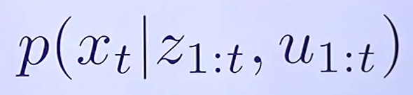
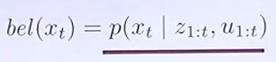
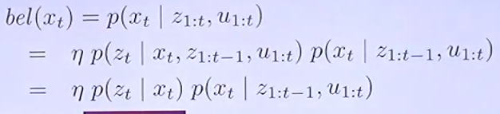
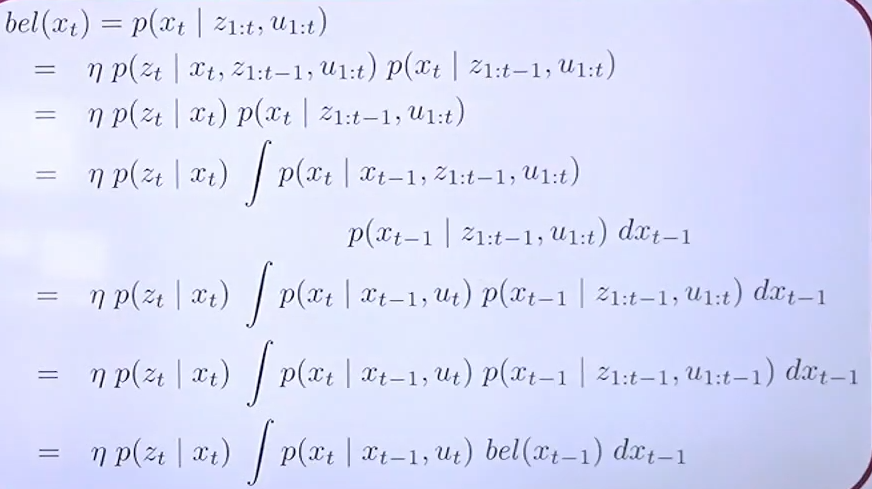
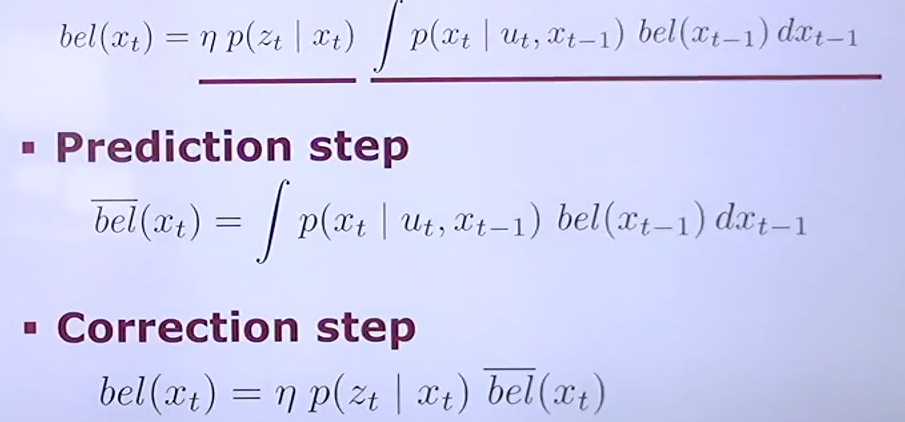
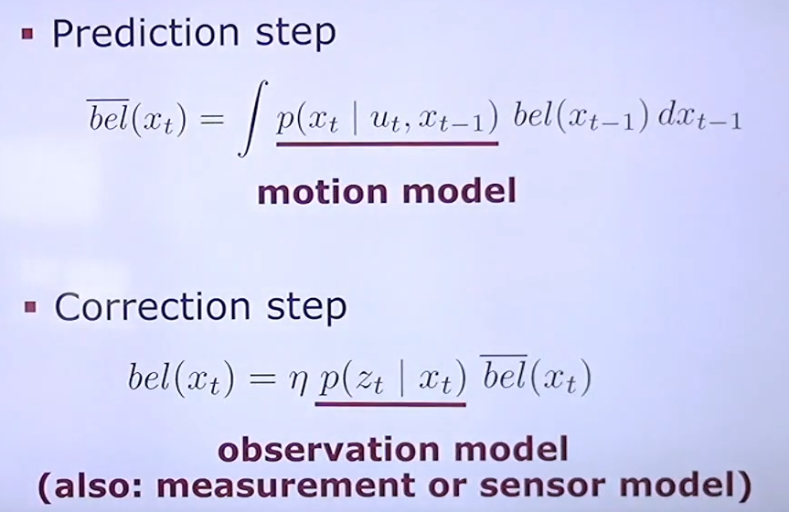
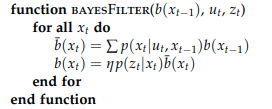
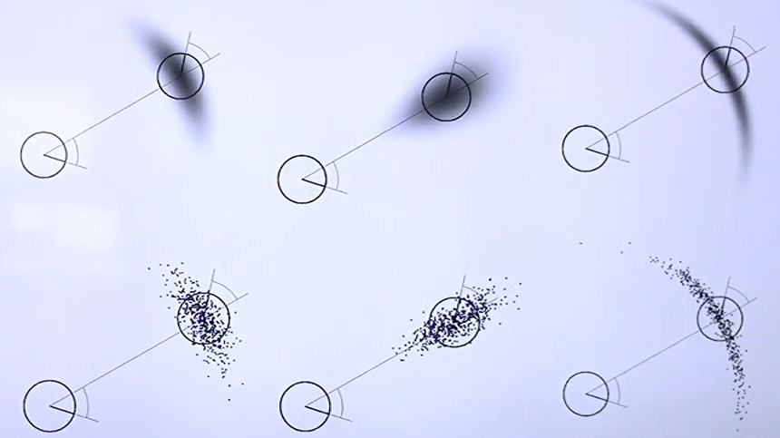
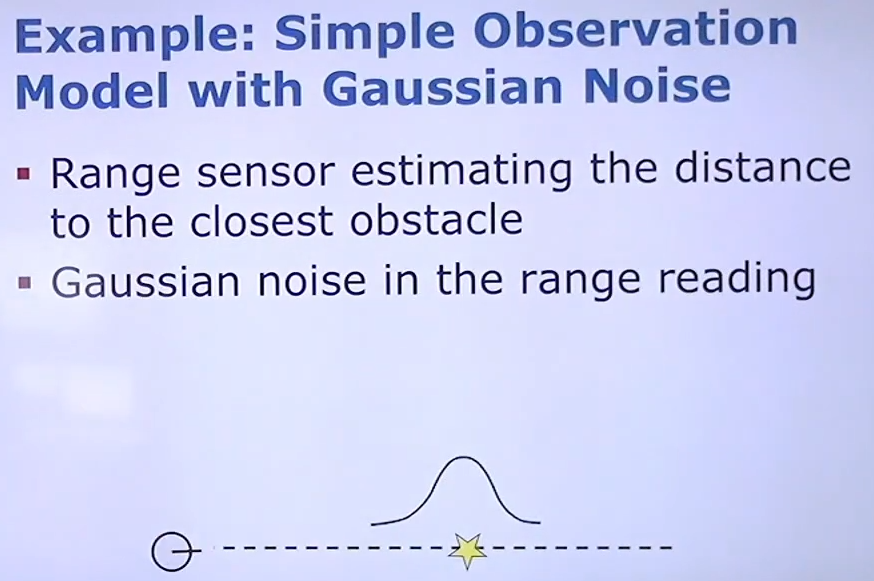

# Bayes Filter 

## 1. Targets:
- [ ] Recursive Bayes Filter: Introductions, how to derive, bayes framework for **recursive state estimation**

## 2. Recursive State Estimation 
> * State Estimation: we want to estimate the state of the system. Ex. where is the robot in the environment, where is a certain 
> object is located. 
> 
> * Recursive...: We want to update our belief based on new observations that come in, reusing the previous distribution that we had 
> and updating the distribution based on the new information. This will turn into the recursive formula

### 2.1. State Estimation 
* Estimate the state **x** of the system at time **t** given all my control commands **u** and my observations **z**. "Estimate 
where are we right now given all observations in the past and the control commands from the past"
    > **Goal**:  
    >
    >  

Example: (From `Probabilistic Robotics - Thrun book` - page 24)

#### 2.1.1 Bayes Filter

The belief of the system (where it is) at time **t**, this is the same with the state estimation equation (belief is the probability distribution)

> 

The things that we wanted here is to simplify this belief distribution. One way to simplify this is to apply **Bayes Rule** and the **Markov's assumption**:

> 

> The complete derivation of the Bayes Filter
> 
> 
> 
> NOTE: A lot of estimation techniques rely on this derivation: Kalman Filter, Extended Kalman Filter, Unsented Kalman Filter,
> Particle Filter, Histogram Filter
> 
> 
**Markov's assumption**:

> * Given I know the state of the system, what happens in the past is decoupled (independent) to the future. In our case, given 
> I know where I am, all the past control commands as well the past observations, they don't tell me anything about what am I observing right now. 
> * The past doesn't impact the future given I know the state in between them
> * Independence assumption assuming that the future motion command doesn't help me in the estimating the state of the past  

#### 2.1.2. Prediction and Correction Step 

From the function of Bayes Filter, we can see it have 2 step process: **Prediction step** and **Correction step**

> 

#### 2.1.3. Motion and Observation Model

> 

#### 2.1.4. Bayes Filter Algorithm Pseudo Code

> With the belief in the discrete field, we can follow this pseudo code:
> 
> 
> 
> Meaning for that function: 
> 

#### 2.1.5. Different Realization 
* The Bayes Filter is a **framework** for recursive state estimation (it just a backbone for us)
* There are **different realizations**
* Different properties:
  * Linear vs Non-Linear models for motion and observation models
  * Gaussian distribution only for models ? 
  * Parametric vs non-parametric filters ?
  * ...

#### 2.1.6. Popular Filters 
* Kalman filter and Extended Kalman Filter
  * Gaussians
  * Linear or linearized models 
* Particle filter 
  * Non-parametric 
  * Arbitrary models (sampling required)

### 2.2. Motion Model

Visualization for the probability of the next state of robot at time t given the previous state and the command executed at time 
t - 1. 

> 

### 2.3. Observation Model 

> 

## 3. Summary
* Bayes Filter is a framework for state estimation 
* There are different realizations of the Bayes filter (ex. EKF, Particle Filter)
* Motion and Observation models are central models in the Bayes filter to be specified. 
## My questions: 
- [ ] What is the different between **Bayes filter** and **Kalman filter** ?
  - **Answer**:
- [ ] Markov's assumption ? 
  - **Answer**: ...

##  Other Valuable Materials: 
- [CSCI 545: Introduction to Robotics - Mostly the course based on this resource](http://stefanosnikolaidis.net/course-files/CS545/Lecture6.pdf)
- ...