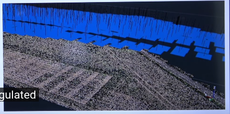

# Bundle Adjustment

> Use to perform 3d reconstruction of the environment from camera data. Given images taken from a camera and want to turn these images into
> a 3d model 
> 
> Use to estimate the orientation of the camera (6 DoF) 
> 
> In this case, we don't have any range sensor (LIDAR), we just have a large set of camera image and then perform the 3D reconstruction.

## Overview
* Has been developed in the 1950s. 
* Bundle adjustment is a state estimation technique (use to estimate the 3D location of points in the environment - those points
has been estimated from camera images)
* Estimate the location of points in 3D, also estimate the location of the camera in the world. 
* This is a Statistically optimal solution (making some assumptions such as Gaussian noise and dependency - the projection process)
* Task: 
  * Minimize the reprojection error: we know the location of the camera and location of the point in the environment. Project the points into 
the camera image (this give us pixel coordinate of that 3d point), then compare the 2d estimated vs the actual point in the image (we are trying to
minimize this different) -> Lead to the solve large **Least squares problem** -> Requires solving a large **System of linear equations**
  * Looking for data associations in images is the part of the problem which takes most of the time. When the errors in  the associations are bad, you are not 
converge to the correct solution. In practice, need robust state estimation techniques (kernels), integrate them into the least square approach to deal with outliers.

## Lecture

### 1. 3D Reconstruction 
* 3D reconstruction using N > 2 images
> 
> Example result:
> 
> - Blue is the image plane
> - The 3d triangulated feature points (SIFT features)
> - This be the output of a bundle adjustment system
> - We can use this output to do further (ex. create orthophoto)

* Why we want **Multi-View Reconstruction ?**, why just 2 image is sufficient ?:
  * When the object is too complex that 2 image can not get the overall structure (occlusion)
  * Some constrains that 2 images not cover.
  * Track the position of the car or UAV, we need the sequences of images

* Applications
  * Generate maps
  * Simulation on virtual camera