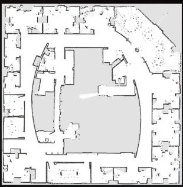
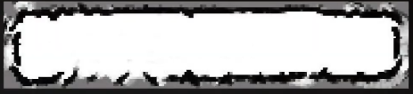
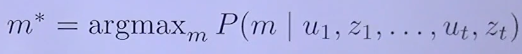
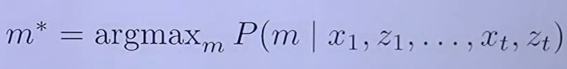

# OCCUPANCY GRID MAP 

## 5 Minutes Overview
* This is the 2D representation of the environment.
* Look like a map for mobile robots, used for navigation tasks: ex. driving around
* Occupancy Grid Map contains:
  * Grid cells: refer to specific place in the environment. A cell is either occupied or free space. 
* Occupancy Grid Map similar to Grayscale image:
  * Black means that cell is occupied by obstacle. 
  * White means that cell is free space.
* Occupancy Grid Map similar to Architecture Floor plan
* We are not certain if a place in the environment is occupied or free, we can only estimate that. Typically use sensor data
  (noisy sensor data) to do. We maintain for every cell a probability of occupancy or free.
* Occupancy Grid Map is a set of these small cells containing probabilities. 
* Occupancy Grid Map use 3 main assumptions: 
  * A cell is either occupied or free space.
  * Grid Cells are independent to each others.
  * The world is static (nothing move around).
* Use sensor data: 
  * Laser range finder
  * Stereo camera
  * RGB-D camera
  * Sonnal

* Use a static state binary Bayes filter to estimate the probability distribution for every place. 
  * If we have high quality sensor 
  (distance is measured very well), we can get very sharp maps in the environment.
     > 
  * If the measure from sensor not well, we have more blurry walls and the map not sharp.
     > 

* Robots use Occupancy Map for:
  * Navigation
  * Path planning 
  * Localization
  * Mapping 
  * Exploration

* Extended version:
  * Voxel 3D Grid Map 

## Lecture 

### Maps 
* Maps are required for some tasks like localization, planning, ... 
* Task of understanding how the environment looks like 
* Learning maps from sensor data is one of the most fundamental tasks in robotics. 

### Features Maps vs Volumetric Maps

* Features-based map store the location of distinct points in the environment (Not used in this lecture)
* Volumetric maps (which included in the lecture)

### Description of Mapping Task 
* Compute the most likely map given the sensor data:
  > 
  > 
  > m: map 
  > u: odometry commands
  > z: observation data 

* Today, we see **how to compute the map given the robot's pose** (replace the commands with the robot positions x - this can be achieved by 
installed a very good GPS IMU which direct provide us the pose estimation, then we can use this pose information to build the map of the environment.)
  > 

