# Binary Image

## Lecture Note
### 1. Binary image
* Binary image is an image with a 1 bit color depth (either 0 or 1 (0 or 255))
* Example of the use-case: Scanned documents, Handwritten digits, Background Subtraction

### 2. Operations on Binary image
#### Connected Components
* We use it to identify which components are connected
* Example: Separation of characters
* It is used as the first step for most processes

```text
Two point A, B are connected if there exists a path that goes from A to B that only through the same component.
```

**a. Neighborhoods on Grids**

We need to define a neighborhood relationship for pixels. There are 2 ways: N4 neighborhood and N8 neighborhood.

**N4 Neighborhood**: The left, right, up, down pixels are connected with the center. 

Indexes: N_4(i, j) = {(i, j-1), (i-1, j), (i, j+1), (i+1, j)}

This is also called "city-block" or Manhattan neighborhood.

**N8 neighborhood**: 

Indexes: N_4(i, j) = {(i, j-1), (i-1, j-1), (i-1, j), (i-1, j+1),
                      (i, j+1), (i+1, j+1), (i+1, j), (i+1, j-1)}

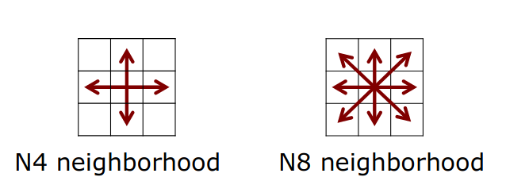

**b. Determining Connected Components via a Graph**
* Build graph with edges according to N8 neighbors
* Idea: Label the nodes in the graphs

**c. Labeling Approach Informally**
1. Select an unlabeled node and assign new label to it
2. For each unlabeled neighbor of a labeled node, assign the same label
3. Repeat step 2 until all neighbors are labeled
4. Repeat step 1 until all nodes are labeled

This is called "brushfire" or "floodfill" approach

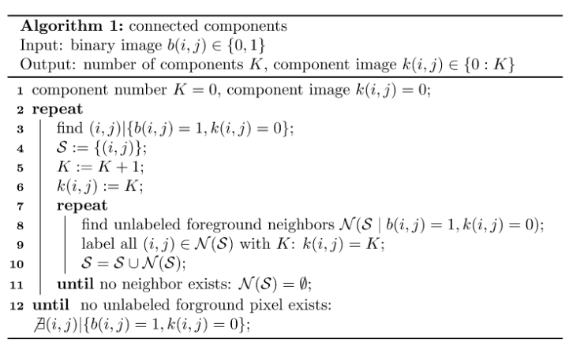

**Properties of the above Algorithm**:
* This work in general graphs
* This does not exploit the systematic neighborhood of images (we are working with the image !!!)

**d. Labeling by Exploiting the Grid Structure of the Image**

Idea: 
* First process the Image in one pass (say from left -> right, top -> bottom)
* Generate a temporary label for a foreground pixel based on the already processed neighbor (this step we can use the 
systematic of the graph to decide which label belong to which pixel)
* In case of multiple labels for the same component, we also need an equivalent table for post-processing 

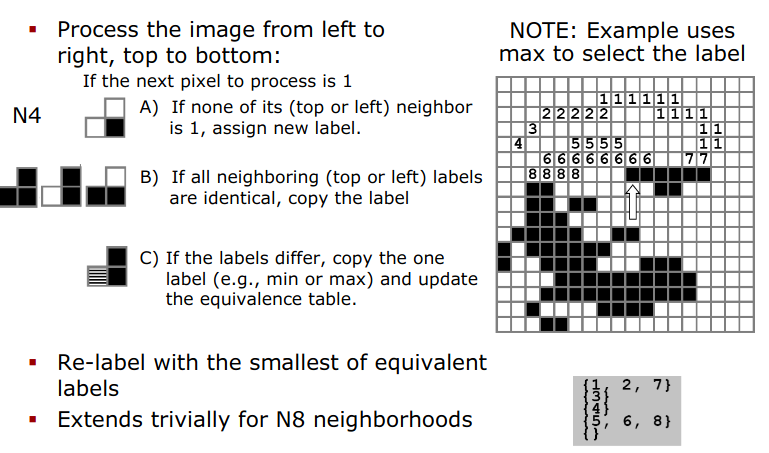

The full algorithm is written bellow: 

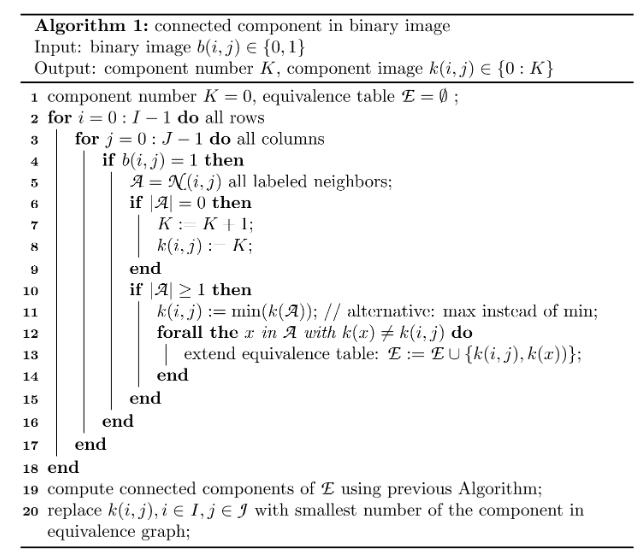

Characteristic: 
```text
* Exploits the grid neighborhood
In N4: 
        x  
     x  o
     
In N8: 
     x  x  x
     x  o
* Requires only one pass through the image of labeling
* Second pass to eliminate duplicate labels
* Then this result in Linear complexity O(N) (N is the number of pixels)
```

#### Distance Transform

Several problems require to compute the distance from any pixel to the border of the components: 
* Nearest neighbor problems: how far is this pixel actually away from a structure that I'm investigating.
* In 3D, this can be applied into range sensor. 
* Map visualization (how far away the User input point to the object, then decide which object user interested in)
* User interfaces 

**a. Formula equation**

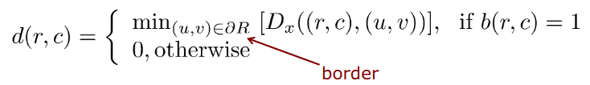

With distance functions:

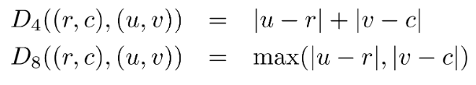

```text
d(r, c): is distance from pixel at (r, c) coordinate of the foreground (assume foreground object when pixel value b(r, c) = 1)
(u, v) is the point at border (mean the point just next to the foreground and it belong to background, see examples) 
Distance is the min distance from source point to the set of boundary point

If source point is at background, then the distance is 0

D_4 use with N4 neighbor: This is manhattan distance
D_8 use with N8 neighbor: This is some how
```

Examples: 

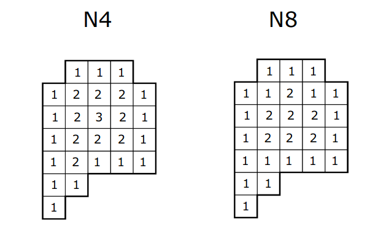

**b. Step to calculate**
* Distance transform can be computed similar to the connected components.
* Use 2 passes over the image: 
  * 1st: top-down, left-right
  * 2nd: down-up, right-left
* Always store the minimum distance

See example to understand the idea: 

* For N4 neighborhood

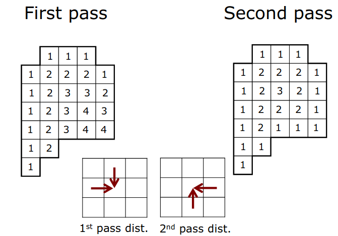

* For N8 neighborhood

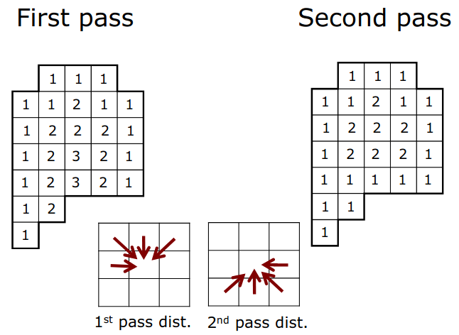

* More examples

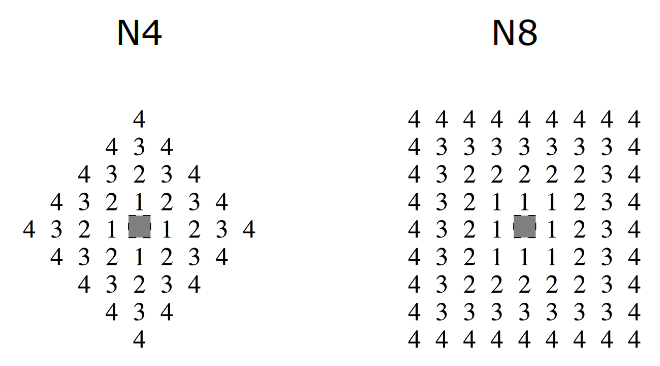

* N4 Transformation in details

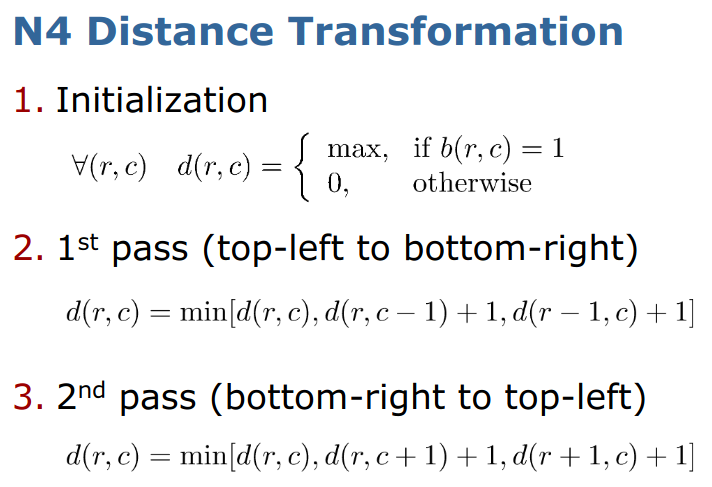

* N8 Transformation in details 


* Characteristic

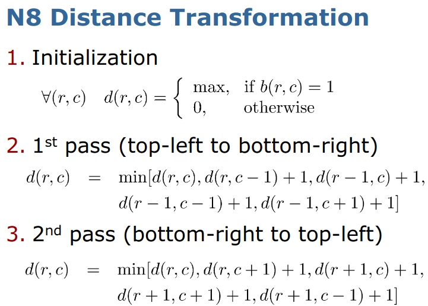

We need a way to combine them to a better one that can have a "good" approximation as Euclidean distance.  

**c. Combine Distance**
* Real cost of the diagonal is sqrt(2) of unit
* Cost for N4 is 2 and cost for N8 is 1
* If we approximate sqrt(2) as 3/2
* Then sum D4 + D8 provides a better approximation for twice the Euclidean distance
* Thus we can take the average distance: 1/2 * (D4 + D8)


**d. Euclidian Distance Transform**
* Use to compute the real Euclidian distance for every cell to the closest border is more difficult 
* EDT in scipy can do that as ndimage.morphology.distance_transform_edt
* EDT in Matlab as bwdist()

#### Morphological Operators: Erosion and Dilation 

**a. Filtering**
* Binary image are often created through thresholding (point operator)
* Operator: b(a) = 0 if a < T and 1 otherwise 
* But in many case, use threshold is not sufficient. 

**b. Morphological Operator**
* Shrinking the foreground (object) ("erosion")
* Expanding the foreground (object) ("dilation")
* Removing holes in the foreground ("closing")
* Removing stray foreground pixels in background ("opening")
* ...

Example for these effects

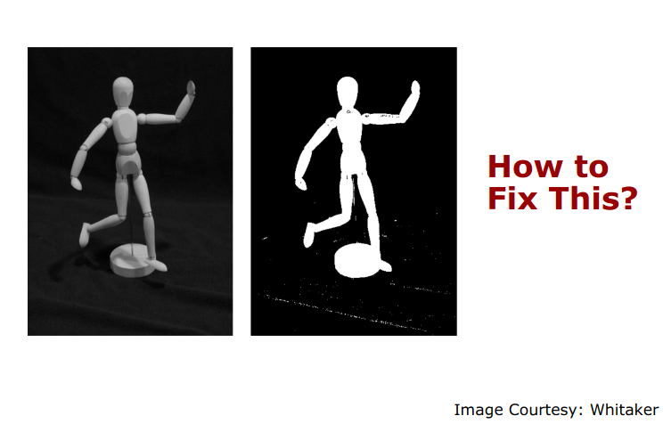

**c. Erosion**

Change each foreground (here black) pixel to a background (here white) pixel if it has **a background** pixel as its N4 
neighbor

Example: 

Before apply erosion

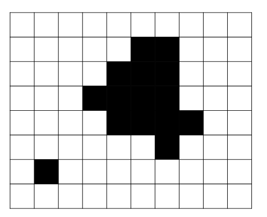

After apply erosion

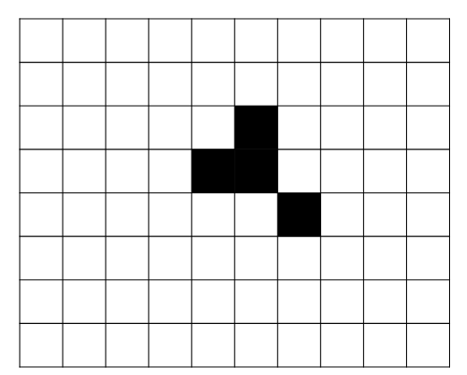

**d. Dilation**

Change each background (here white) pixel to a foreground (here black) pixel if it has **a foreground** pixel as N4 
neighbor 

Example: 

Before apply dilation 

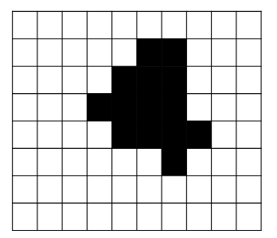

After apply dilation

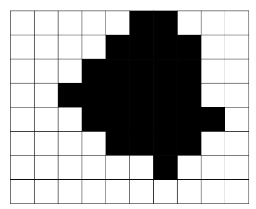

**e. Opening and Closing**

Opening:
* Removing the stray foreground pixels in background 
* Step 1: erosion; Step 2: dilation 

Closing: 
* Remove holes in the foreground 
* Step 1: dilation, Step 2: erosion

So: Erosion and Dilation are local operators, they take the neighborhood into account
