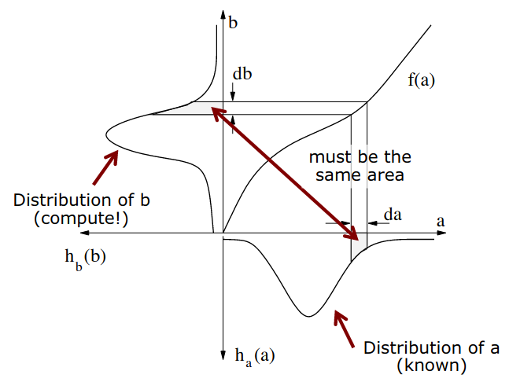
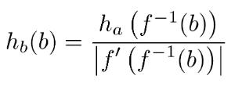
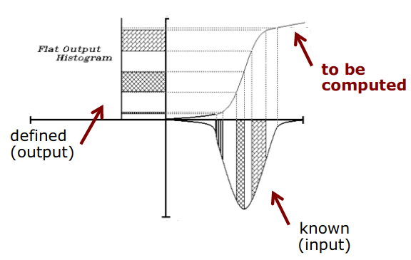
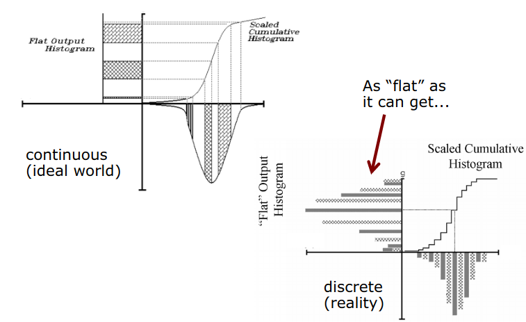

# Image Histograms

## 1. What is Image Histograms ? 
* The histogram show often the pixel intensity values occur in the image. 
* Histogram is a 2D bar plot where x-axis are the elements, y-axis is the occurrences for these items.
* With the RGB image, this tell how the distribution of intensity value along 3 color channels.

## 2. Usage of Image Histogram
* Analyse the image 
* Enhance the image
* Change the image
* Map intensity values into new intensity values


## 3. Manipulate Histogram
* Use a function that change the intensities of pixel -> change the histogram. These so called the point operators, they can
change the contrast, brightness and other properties of image.
* "Tone Curve": we can design tone curves so that the result image will get specific properties.
* Noise variance equalization: all pixels in the end have the same noise (this is used to analyse the image w.r.t the intensity value). 
* Histogram equalization: transform so that all bins of the target image histogram should have the same count -> Lead to 
a more contrast image. 

## 4. Where it is ? 
* Use in photography, photogrammetry, computer vision. 
* Use it as the pre-processing step for further algorithms. 

## 5. Lecture Note

### a. Image as a Function

For a Gray scale image: g(i, j): B -> G

with B: N -> N (B in range [0 ... I - 1, 0 ... J - 1]) and G = N (in range [0, 255])

### b. Histogram function
* Number of bins
* Def: h(g) = #number pixel with value g in the image. 
* Histogram function -> probability function: p(g) = h(g) / N (N is number of pixels in the image)

### c. Histogram Computation
* Iterating through the image, complexity is O(N) with N is number of pixels.
* Numpy already have this.

### d. Cumulative Histogram
* H(g) = Sum h(x) where x in range (0, g) 
* This is the integral of the histogram function
* Relation to PDF (Probability distribution function) and CDF (Cumulative distribution function) of the possible intensity 
values that occur in the image. (p(g) = h(g) / N as said above vs F(g) = H(g)/N )

### e. Histogram vs Information
* Tell us about the intensity overall of the image, (ex. change histogram -> change contrast, brightness (the mean and variance))
* Mean describe brightness, variance describe contrast, median is robust description of brightness. 

### f. Type of functions to change histogram
* Global operator
* Local operator
* Point operator


### g. Point Operator

b(i, j) = f(a(i, j), p) with b new image, a original image, p parameter 

#### Linear function form: 
b(i, j) = k + m * a(i, j)

k - shift the histogram - brightness

m - affect the contrast of the 
image (because it changes the range of pixel value).

The mean and deviation have changed: 
new_mean = k + m * old_mean  and new_deviation = |m| * old_deviation

This linear function form can be express in the "Tone Curve" as a straight line. Where x-axis is intensity of original, 
y-axis is value after applying the transform (so k is the intersection point of tone curve line and y-axis, m denote the
slope of line). Notice: m = -1 this is equal to flip the histogram (255 become 0 and so on...)

**Characteristic of Linear function**: When apply linear function to original image, we will lose some information, 
because all the pixel result which larger or smaller than threshold (here is 0 and 255) must be clipped !!!

#### Nonlinear functions:

* Thresholding: return black-white image (most case we do this). Then the tone curve has step function shape.
* Quantization: this is the general term of threshold, by given more return value base on the range of intensity in original image.
  (this is happens inside the chip of the camera to quantize the photon to intensity pixel)

#### Realizing Point Operators:
* This is efficiently computed using look-up table (1-D array where index is the input intensity and value at that index 
become the output intensity)
* 1-D array have fixed length, function evaluation corresponds to reading a byte from memory

### h. Histogram on Color Images
* We build a histogram for each channel (3 channels have 3 histograms).
* Manipulate the individual channel with those function

### i. Histogram Equalization
Idea: take all the intensity values that we have in our image and distribute them uniformly over the range of intensity 
value (from 0 to 255). 

#### How the Operator function affect the Distribution of Intensities (histogram) ? 
* Assume monotonous function b = f(a)
* Histogram of input image: h_a(a)  (a is the query input intensity value)
* Compute the histogram of image b: h_b(b) when given h_a(a) and f
* We use the gained knowledge to design f to map from a to b with the desired constraint of histogram of b. 
* Then we have to know the relation how h_a(a) become h_b(b) with the function f ?

#### Transformation of a PDF 



We have h_a, f, then how we find the h_b 
In the image above, all image from range da (say from 150 to 155) must be the same in the range db (say range from 
f(150) to f(155) - that is the reason why the Curve f is monotone - not the sine wave or sth like that).

* The gray "area" in the interval [a, a+da] is mapped to the interval [b, b+db]
* So h_b(b) * db = h_a(a) * da (the integral of 2 area must be the same)
* Then h_b(b) = h_a(a) / |db / da|
* And db / da is the derivative of f, so:
* h_b(b) = h_a(a) / |db / da| = h_a(a) / |f'(a)|
* Have b = f(a) => a = f^-1(b)
* Then h_b(b) = h_a(f^-1(b)) / |f'(f^-1(b))| **(1)**



Function **(1)** means, if we know h_a and f, then we can compute h_b at any b (in our case b in range [0...255])

#### Design Transformation f Such that the Resulting Image has Desired Properties. We have 2 examples: Histogram Equalization and 


#### Histogram Equalization 

* Idea: "All bins are equally used in the result" - Uniform distribution of h_b
* Why we use this technique: enhance image (image contain mainly dark and light, then hard to detect features, use this 
for dealing with this case)
* Given h_a and desired h_b(b) = const at all b [0, 255], compute the map function f



```text
Assume f is monotone, increase

Have:
h_b(b) = k (our desired distribution function k is constant scalar)
h_b(b) = h_a(a) / (db/da)    (f is monotone, increase)

Then: 
k = h_a(a) / (db/da) => db = (1 / k) * h_a(a) * da   (2)

Solve via integration, from (2) we have: 

    I(db) = I((1/k) * h_a(a) * da) 

<=>  b + C1 = (1 / k) * I(h_a(a) * da)

<=>  b + C1 = (1 / k) * H(a) + C2      (H(a) is the Cumulative histogram)  

<=>  b = (1 / k) * H(a) + C  = f(a)

Use constrain to compute k and C, we can typically choose that the smallest remain the smallest, the largest remain the 
largest: 

f(0) = 0 and f(255) = 255

Then:
k = (N - H(0)) / 255     # N is number of pixels in image
C = -H(0) * 255 / (N - H(0))

Final f (for image case [0...255])

f(a) = round(255*(H(a) - H(0)) / (N - H(0)))
```

#### Uniform Distribution Constrain in Discrete Image?



* Due to Ideal world is Continuous but in the Image it is Discrete
* The result can be improved if we map from higher range value to lower range value (say from 16 bit to 8 bit)


#### Effect of Histogram Equalization
* Typically, increase the contrast (use all the intensity value)
* Areas of lower local contrast gain higher contrast (due to the uniform distribution)
* Distribute the intensities over the histogram

#### Variants of Histogram Equalization
* Adaptive HE (AHE) - perform HE in local patches, not the whole image.
* Contrast limited AHE (CLAHE)

```python
# TODO: Need more research here !!!
```

# Noise Variance Equalization

* Intensity measurements on image sensor are not perfect (they contain noisy)
* Goal: adjust the variance of the intensities to a fixed value. 
* Useful for statistical analysis of images (all pixels have the same variance)

## Distribution About the Number of Incoming Photons
* Use Poisson distribution: 
```text
P(k) = (Beta * t)^k / k! * e ^(-Beta * t)

With
Beta: the average number of incoming photon to sensor chip persecond
t: exposure time
```
This express the distribution about the number of photons reaching the sensor. 

```text
* Mean and variance:
mean = Beta * t
variance = Beta * t

Standard deviation: sqrt(variance) = sqrt(Beta * t)
```

```python
# TODO: Need more RESEARCH !!!!
```