# Supplementary for ex03 and ex05

In this chapter, we learn about:

Projective Geometry and Camera Parameters - How to map the point **X** in real world to the point **x** in image:

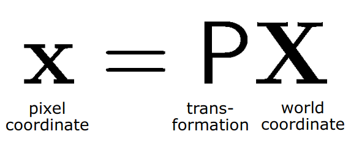

In terms of Homogeneous Coordinate, this equation become: 

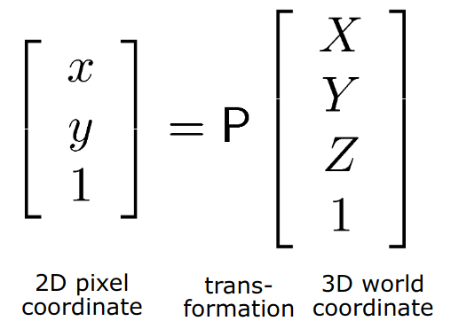

There are 4 coordinate systems that being used to perform this kind of transformation:
1. World/Object coordinate system notation as 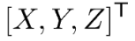
2. Camera coordinate system (k): 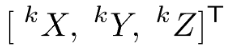
3. Image plane coordinate system (c): 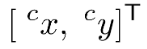
4. Sensor coordinate system (s): 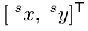

Using these coordinate, we form the chain process as: 

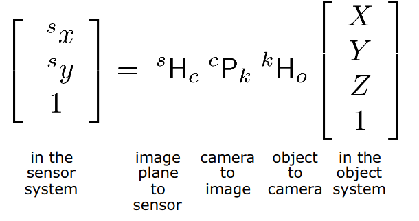

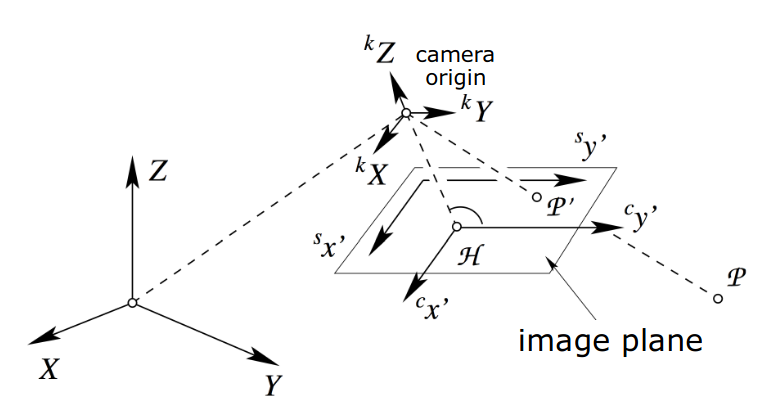

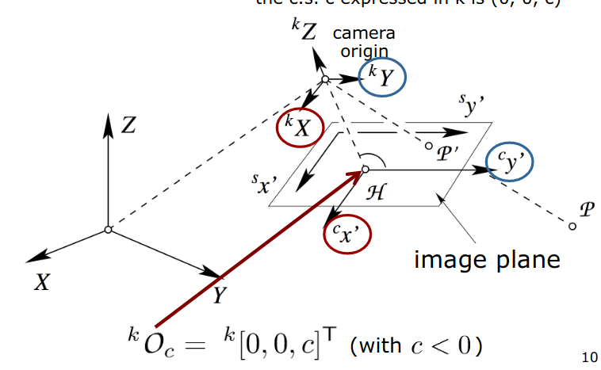

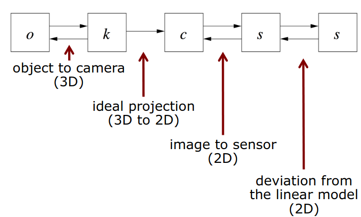

Then the term extrinsic and intrinsic parameters:

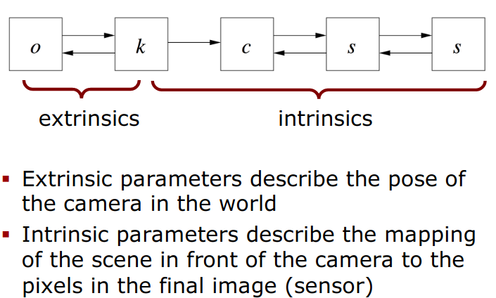

**Notice**: The final image we got, it is on the sensor !!!

## Extrinsic parameters
* It describes the pose (position and heading) of the camera with respect to the world.
* It is the invertible transformation (We have K then we also have K^(-1))

It requires 6 parameter - Rigid Body Transformation : 3 for the position (Translation on x, y, z) + 3 for the heading (Yaw, Pitch and Roll)

In Euclidean System, suppose we have a point P in world coordinate and the center O of the projection (Origin of the camera system)

(Both of these points are notated in the Object/World coordinate system)

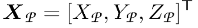

and 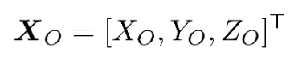

Rigid Transformation in Extrinsic Parameter here is: 
* **The Translation**: between the origin of the world coordinate system and the camera system, this is equivalent to 
$X_{O}$. This is used to adjust the origin of world become the origin of camera c.s

* **The rotation**: R to adjust the x, y, z axis of world c.s to camera c.s
Notice that, we use 3 params here to denote the Rotation in Euclide (Yaw alpha, Pitch beta and Roll gamma) 

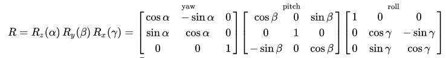

In **Euclidian coordinate**, this yields: 

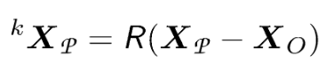

This mean we convert P (3 dimension) from world c.s to P (3 dimension) in camera c.s

In **Homogeneous Coordinate**, we add the 1 as the additional data dimension.

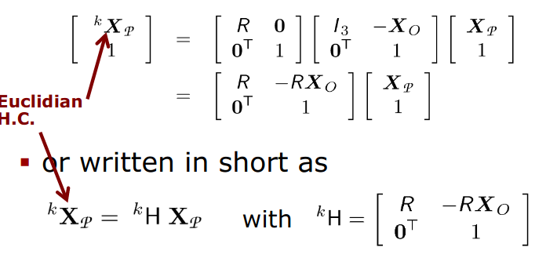

Notice that: In H.C then this chain is (4x1) = (4x4) * (4x4) * (4x1)

The H_k matrix is form of (4x4) matrix

## Intrinsic Parameters

This is used to project points from the camera c.s to the sensor c.s.

Invertible transformations:
* Image plane to sensor
* Model deviations

Not invertible: central projection (this is the step map from 3d to 2d)

Therefore, to perform inside camera, we have 3 steps: 
1. Ideal perspective projection to the image plane.
2. Mapping to the sensor coordinate system ("where the pixel are"")
3. Compensation for the fact that two previous mapping are idealized. We add more terms because the real situation is not ideal.

So Ideal Perspective Projection, it has: 
1. Distortion-free lens 
2. All rays are straight lines and pass through the projection center. This point is the origin of the camera coordinate
system. 
3. Focal point (principal focus - F) and principal point (O) lie on the optical axis.
4. The distance from the camera origin to the image plane is the constant c

