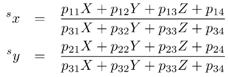

# Supplementary for ex03 and ex05

In this chapter, we learn about:

Projective Geometry and Camera Parameters - How to map the point **X** in real world to the point **x** in image:


In terms of Homogeneous Coordinate, this equation become: 


There are 4 coordinate systems that being used to perform this kind of transformation:
1. World/Object coordinate system notation as 
2. Camera coordinate system (k): 
3. Image plane coordinate system (c): 
4. Sensor coordinate system (s): 


Using these coordinate, we form the chain process as: 


Then the term extrinsic and intrinsic parameters:


**Notice**: The final image we got, it is on the sensor !!!

## Extrinsic parameters
* It describes the pose (position and heading) of the camera with respect to the world.
* It is the invertible transformation (We have K then we also have K^(-1))

It requires 6 parameter - Rigid Body Transformation : 3 for the position (Translation on x, y, z) + 3 for the heading (Yaw, Pitch and Roll)

In Euclidean System, suppose we have a point P in world coordinate and the center O of the projection (Origin of the camera system)

(Both of these points are notated in the Object/World coordinate system)


and 


Rigid Transformation in Extrinsic Parameter here is: 
* **The Translation**: between the origin of the world coordinate system and the camera system, this is equivalent to 
$X_{O}$. This is used to adjust the origin of world become the origin of camera c.s

* **The rotation**: R to adjust the x, y, z axis of world c.s to camera c.s
Notice that, we use 3 params here to denote the Rotation in Euclide (Yaw alpha, Pitch beta and Roll gamma) 


In **Euclidian coordinate**, this yields: 


This mean we convert P (3 dimension) from world c.s to P (3 dimension) in camera c.s

In **Homogeneous Coordinate**, we add the 1 as the additional data dimension.


Notice that: In H.C then this chain is (4x1) = (4x4) * (4x4) * (4x1)

The H_k matrix is form of (4x4) matrix

## Intrinsic Parameters

This is used to project points from the camera c.s to the sensor c.s.

Invertible transformations:
* Image plane to sensor
* Model deviations

Not invertible: central projection (this is the step map from 3d to 2d)

Therefore, to perform inside camera, we have 3 steps: 
1. Ideal perspective projection to the image plane.
2. Mapping to the sensor coordinate system ("where the pixel are"")
3. Compensation for the fact that two previous mapping are idealized. We add more terms because the real situation is not ideal. We summarize the non-linear affect here.


### Central projection
This is process to reduce dimension (from 3D to 2D). 

So Ideal Perspective Projection, it has: 
1. Distortion-free lens (a perfect len)
2. All rays are straight lines and pass through the projection center. This point is the origin of the camera coordinate
system. (a perfect pinhole)
3. Focal point (principal focus - F) and principal point (the point where the principal planes intersect with optical axis) lie on the optical axis.
4. The distance from the camera origin to the image plane is the constant c.

And some modify for **Image Coordinate** system, when the image plane is rotated 180 degrees to make the image the same 
orient as the object. Therefore, the constant c - distance from camera origin to image plane is negative (c < 0)


So we use Intercept theory to calculate the projected point onto the image plane with the coordinate as: 


Notice that the Z term of projection of P onto the image plane is always constant, so we can ignore it. See my post [here](https://github.com/Nacriema/Camera_Projections/tree/master/inverse_projection)


Use the last equation above is the formula of Projective in Homogeneous Coordinate. 

Verify the result: 


Thus, for every point P in camera c.s, the projection process is: 


With: 


```
k: camera c.s
c: image plane c.s
```

Then with an Ideal Camera, the mapping process: From object c.s to camera c.s (Extrinsic params), then from camera c.s to image c.s


and:


## Calibration Matrix

From the given equation, we can define the **calibration matrix for the ideal camera** as: 


Then the overall mapping can write as: 


And the full matrix representation:


In Euclidean coordinate, this formula becomes (divide 1st and 2nd item with the 3rd item)


## Mapping to the Sensor (without non-linear errors)

* Mapping from the image to the sensor
* Location of the principal point in the image
* Scale difference in x and y based on the chip design
* Shear compensation

The origin of the sensor system is not at the principal point 


H is the principal point, but the origin of the sensor is on the top-left

Then to convert it to Sensor c.s then we do a shift: 


## Adding Shear and Scale Difference
* Scale difference by m in x and y 
* Shear compensation s (for digital cameras, we typically have s near 0) 

So combine them, to map from image plane to sensor, we need the matrix:


Finally, we have the process from world coordinate to sensor coordinate (without non-linear errors)


**Notice:** Often this transformation matrix is apply with the previous calibration matrix to a compact form of calibration


K is the Calibration Matrix - it is an **affine** transformation (Affine transformation is any transformation that preserve the 
collinearity i.e all points lying on a line initially still lie on a line after transformation)


This matrix contains **5 parameters**: 
* Camera constant: c
* Principal point x_H, y_H
* Scale difference: m
* Shear: s


## DLT: Direct Linear Transform

The mapping we have learned so far is called Direct Linear Transform. It is the model of **Affine Camera**. 
Then an **Affine camera** is a camerae with an affine mapping to the sensor c.s  (after the central projection is applied)

The projection matrix to map from object c.s to sensor c.s: 


This matrix contains **11 parameters**:
* 6 extrinsic parameters for the Rigid Transformation
* 5 intrinsic parameters: c, x_h, y_h, s, m


And the equation for Euclidian:



## Non-Linear Errors 

In real world case: Non-linear errors, due to some reasons: 
* Imperfect lens 
* Planarity of the sensor 

Then the idea that we perform the DLT and then at the last step, we add the non-linear elements. 

To add non-linear errors, in general, we use **individual shift for each pixel** as: 


Where Delta x and Delta y are difference w.r.t their location in the image. 


Overall, the general mapping process from sensor c.s to sensor c.s 


the a in notation just the annotation for final c.s (actually this from s to s by the previous scheme)

So that the overall mapping from world c.s to sensor c.s is: 


## General Calibration Matrix

It is the combination of Calibration for affine camera with the General mapping H above. 


## Approaches to Modeling H - Nonlinear Error

* Barrel Distortion
* ....


Inversion of the Mapping

