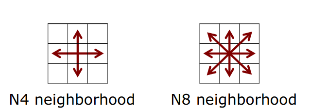
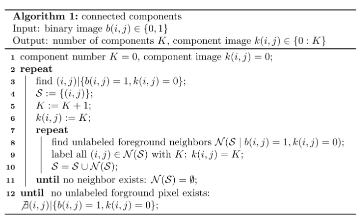
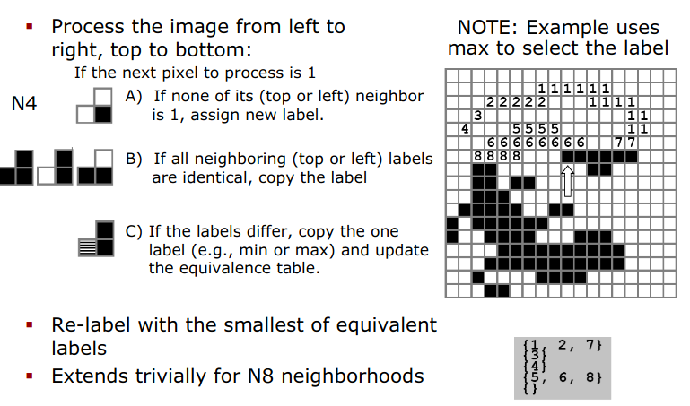

# Binary Image

## Lecture Note
### 1. Binary image
* Binary image is an image with a 1 bit color depth (either 0 or 1 (0 or 255))
* Example of the use-case: Scanned documents, Handwritten digits, Background Subtraction

### 2. Operations on Binary image
#### Connected Components
* We use it to identify which components are connected
* Example: Separation of characters
* It is used as the first step for most processes

```text
Two point A, B are connected if there exists a path that goes from A to B that only through the same component.
```

**a. Neighborhoods on Grids**

We need to define a neighborhood relationship for pixels. There are 2 ways: N4 neighborhood and N8 neighborhood.

**N4 Neighborhood**: The left, right, up, down pixels are connected with the center. 

Indexes: N_4(i, j) = {(i, j-1), (i-1, j), (i, j+1), (i+1, j)}

This is also called "city-block" or Manhattan neighborhood.

**N8 neighborhood**: 

Indexes: N_4(i, j) = {(i, j-1), (i-1, j-1), (i-1, j), (i-1, j+1),
                      (i, j+1), (i+1, j+1), (i+1, j), (i+1, j-1)}



**b. Determining Connected Components via a Graph**
* Build graph with edges according to N8 neighbors
* Idea: Label the nodes in the graphs

**c. Labeling Approach Informally**
1. Select an unlabeled node and assign new label to it
2. For each unlabeled neighbor of a labeled node, assign the same label
3. Repeat step 2 until all neighbors are labeled
4. Repeat step 1 until all nodes are labeled

This is called "brushfire" or "floodfill" approach



**Properties of the above Algorithm**:
* This work in general graphs
* This does not exploit the systematic neighborhood of images (we are working with the image !!!)

**d. Labeling by Exploiting the Grid Structure of the Image**

Idea: 
* First process the Image in one pass (say from left -> right, top -> bottom)
* Generate a temporary label for a foreground pixel based on the already processed neighbor (this step we can use the 
systematic of the graph to decide which label belong to which pixel)
* In case of multiple labels for the same component, we also need an equivalent table for post-processing 



The full algorithm is written bellow: 


Characteristic: 
```text
* Exploits the grid neighborhood
In N4: 
        x  
     x  o
     
In N8: 
     x  x  x
     x  o
* Requires only one pass through the image of labeling
* Second pass to eliminate duplicate labels
* Then this result in Linear complexity O(N) (N is the number of pixels)
```


 


