# Local Operators Through Convolutions

Look back: 
* We have 3 types of Operators on image: Point operator, Local operator and Global operator 
  * Point operator: we just take one pixel value into account when performing transformation: Ex Histogram Equalization, 
Binary threshold, ...
  * Local operator: we need a group of neighbor of current pixel to perform transformation: Ex Convolution, Distance Transform, ...
  * Global operator: 

* Limited of Point Operators:
  * It cannot deal well with noise (Ex when perform gradient operator on the raw image with noise, then many edges pop up)
  * Not deal well with local structures ("one intensity value is not enough")

## Part 1: Smoothing Filters
### Box Filter

**It is used to replace an intensity value by the mean intensity value of the neighborhood.**
```text
With 1D signal:
g(i) = 1/K * sum_k f(i-k)

With 2D signal: 
g(i, j) = 1/(K*L) * sum_k,l f(i-k, j-l)

Where k, l are delta indexes with zero is the center (mean the index at the result what we want to compute)
```

Example:

g(i) = 1/K sum_k f(i-k)    with k = {-1, 0, 1} and f = [100, 126, 110, 97, 99]

This give us [?, 112, 111, 102, ?]

With 2D signal:

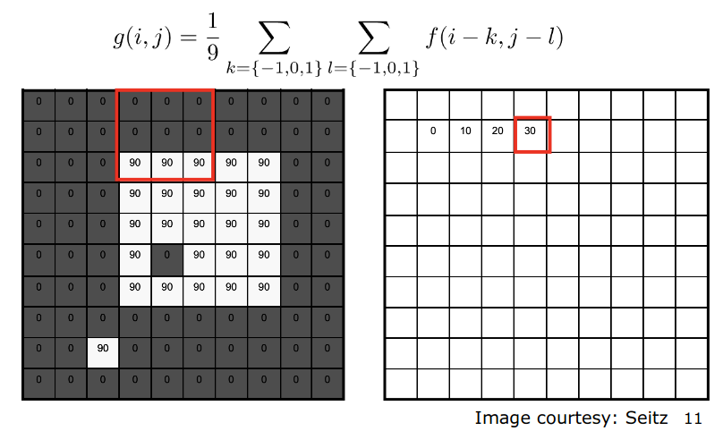

Then the final result:

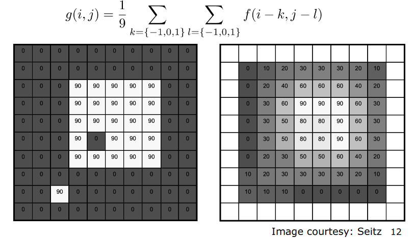

We can see that after doing this, the single hole in the image is filled

For better implementation, we then define a new term called **KERNEL**

**a. Kernel**
```text
We can formulate the box filter with a weigh function w (this is also called kernel):

g(i, j) = sum_k,l ( w(k, l) * f(i-k, j-l) )
```

**NOTICE: Through the weight function, we can specify the behavior of how my local operator actually look like**


The formular bellow then define a new operator called **Convolution**

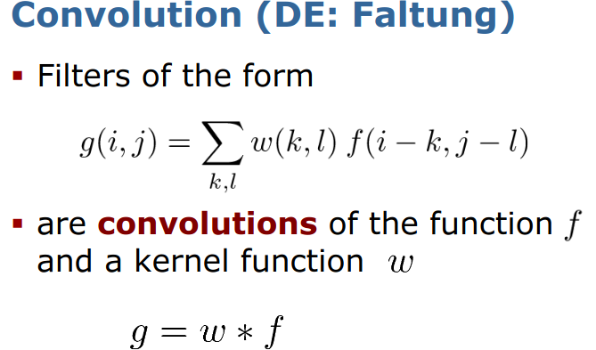

This is the definition with a Discrete, in form of Continuous then we do Integral.

So in terms of Convolution, a **box filter (R)** is a **convolution** of the image function f and a box kernel:

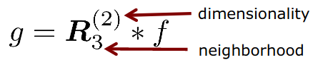

Example for the **box filter**: 

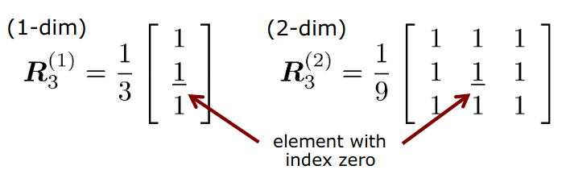

Example of 1D Box Filer (Neighborhood 3)

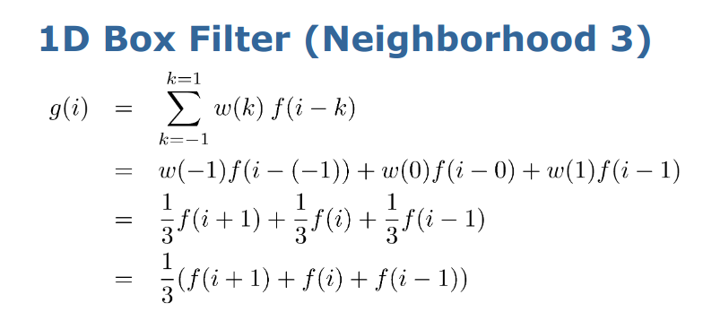

**Effect of the Box Filter**

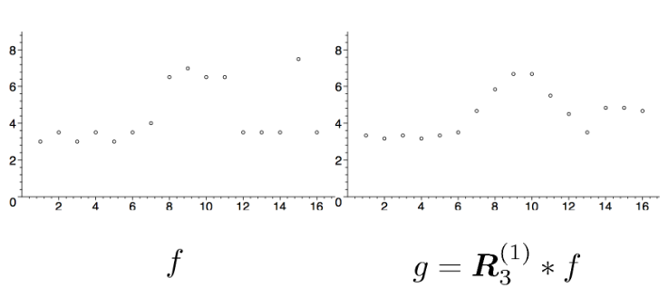

Using different Box Size (here is 3 and 5)
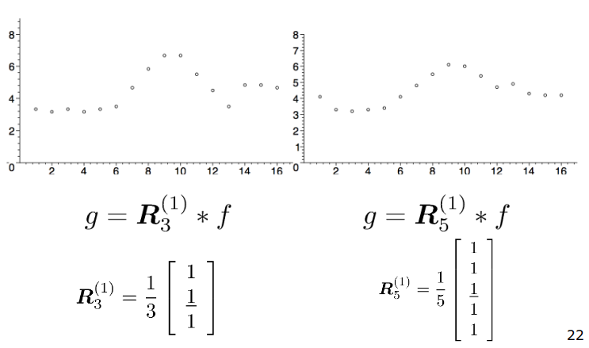

Large box size lead to smoother result.

**Effect of Box Filter**
* The box filter reduces the noise in the input signal.

### Median Filter 
* We compute the median within the neighborhood instead. 

```text
Example of median
[1, 3, 3, *6*, 7, 8, 9] -> Median = 6

[1, 2, 3, *4, 5*, 6, 8, 9] -> Median = (4 + 5) / 2
```

* Median filter is not a Linear Filter anymore

### Binomial Filter
* This use Kernel weight as the approximation of a Gaussian filter (discrete approximation).
* The decay of the weights approximates a Gaussian using the coefficients of Binomial distribution B(0.5, n)
* This then lead to the Elements of Pascal Triangle.

Example of Binomial Filter with p=0.5

1D signal:

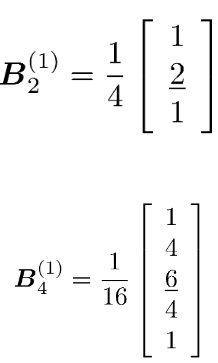

The connection between weight of Binomial and Pascal's Triangle:

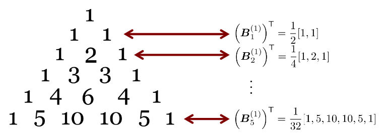

Example of resulting 1D signal with **Binomial Filter**

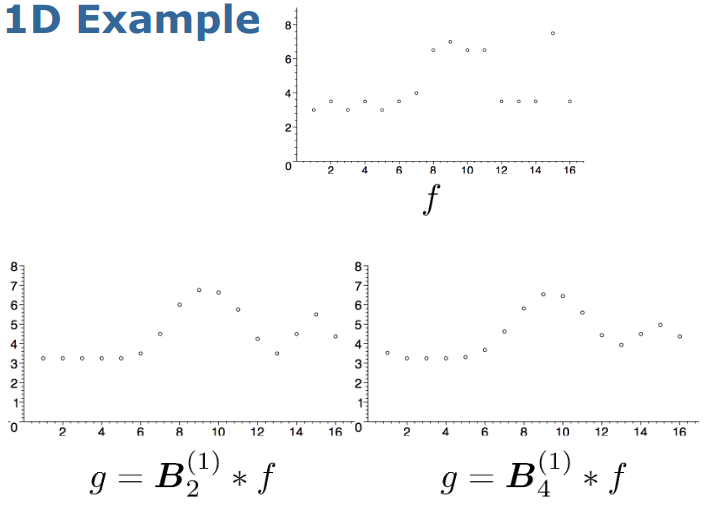

Example of **Binomial Kernel in 2D**

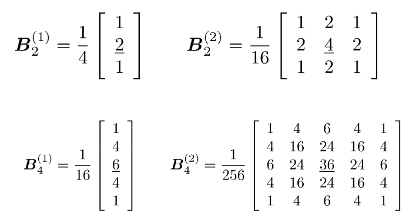

Resulting 2D signal with **Binomial Filter**

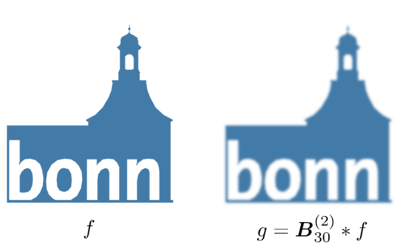

**Noise Reduction Affect of Binomial Filter**

* Use **Degree of Smoothing** to measure the noise reduction affect

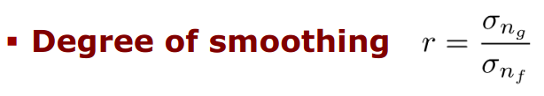

```text
Degree of Smoothing = Standard deviation of the output divided by the standard deviation of the input.
```

* Box filter give a stronger smoothing than the Binomial filter.

### Dealing with the Borders
* We use Padding: Extending the image this is used so that we want the result have the same size with the original.
* Options for padding: 
  * **constant value**: for all outside pixels.
  * **cyclic wrap**: loop "around" - cyclic the image and copying the image 
  * **clamp**:  repeat the edge pixel value for the outside pixels.
  * **mirror**: reflect pixels across the image edge.

### Convolution 

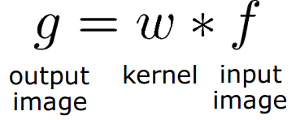

**Definition:**

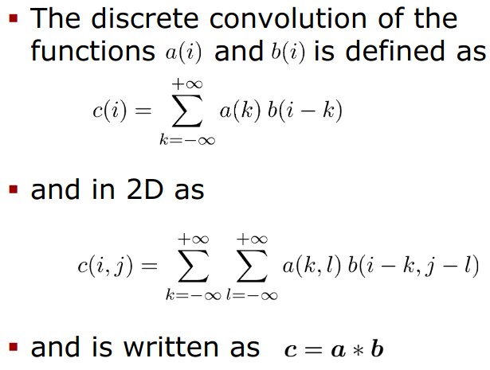


**Properties of the Convolution:**
* Commutative Property

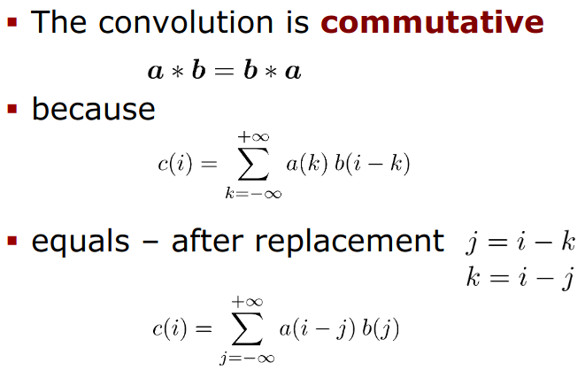

* Further Properties: Associative, Distributive, Scalar multiplication

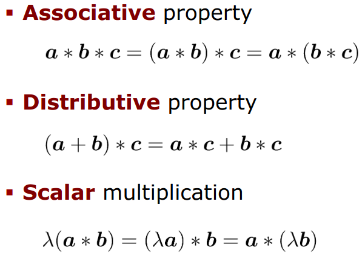

**Unit Impulse / Neutral Element**

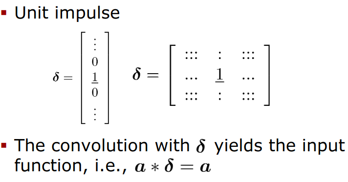

* Translation/ Shift Through Convolution (when move the 1 to another position and the root is 0)

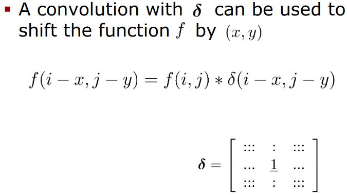


* Multiplication and Convolution 

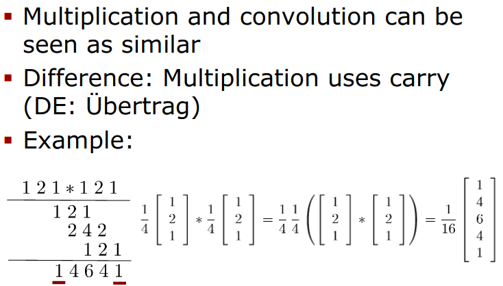

**Separable Kernels**

* A multi-dimensional kernel that can be split into the individual dimensions is called **separable**.
* Example:

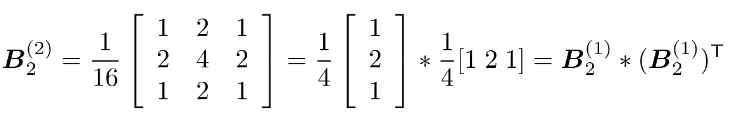

**Binomial Filter** is one example for **separable kernel**

* Separable Kernel allow us for Efficient Computation

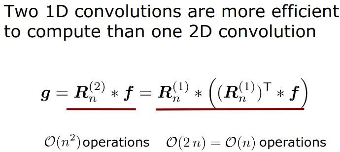

**Multiple Convolutions**

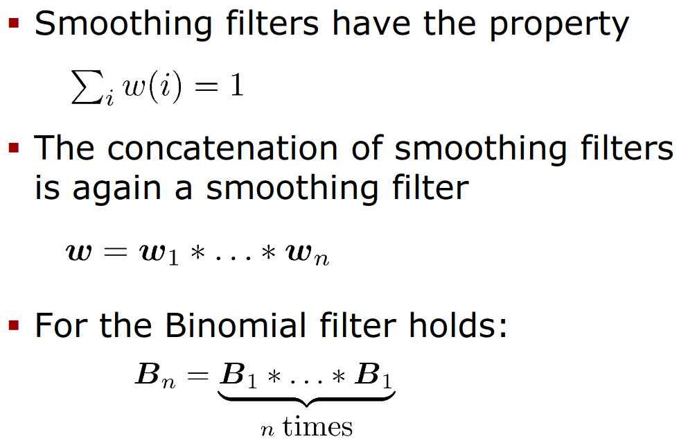


**Integral Image**

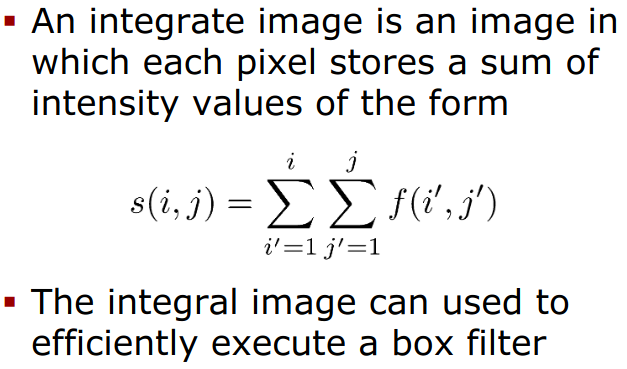

Integral image allow us the effective computing some task, for example Face Detector (HaarCascade) or compute the convolution 
of Box Filter with the image: 

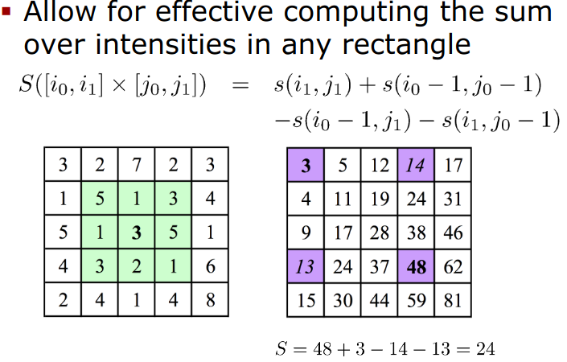


### Linear Shift Invariance Filter

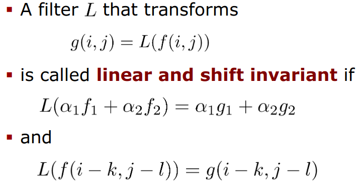

## TODO 
- [ ] Need to fix the np.multiply() function, I've performed cross-correlation instead of Convolution, see https://stackoverflow.com/questions/44772451/what-is-the-best-way-to-perform-an-anti-transpose-in-python


