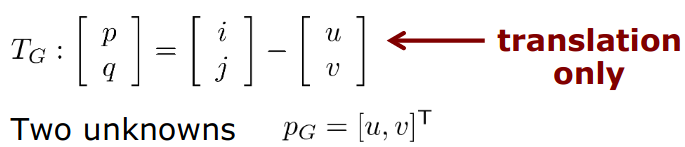

# Template Matching Using Cross Correlation

## Usage
* This technique is use in **Data association** task - Define a point in that image corresponding to which point in the other images.
* Data association then used for 3D construction task. 

## What is Cross Correlation ?
* It is a powerful took to
  * Find certain image content in an image (Template Matching)
  * Determine its location in the image 

* Key assumption before use this technique: Images differ only by:
  * Translation
  * Brightness
  * Contrast

## What is Template Matching ?
* Find the location of a small template image within a larger image
* Usually: the size of template << size of image

* Principle in template matching: 
    * Given image g_1(i, j) and template g_2(p, q) 
    * Find offset [u, v] between g_1 and g_2

So Cross Correlation is a member of Template Matching

## Assumptions in Cross Correlation

* Geometric Transformation: (Translation)

Above then p_g = [u, v] is the translation vector

* Radiometric transformation: (Change in brightness and contrast)

a change the mean of g_1, b change the variance of g_1

**TASK: Find the offset [u, v] that maximize the similarities (minimize the difference) of the corresponding intensity value**

## Typical Measures of Similarity

* Sum of squared differences (SSD)

* Sum of absolute differences (SAD)

* Maximum of differences 

One problem of those measurements is they are not invariance with Radiometric transformation (if g_1 and g_2 different 
in contrast and brightness then the results differ)

So we use **Cross-Correlation** instead

## Cross Correlation Function 

Estimate the position [u, v] of the given patch in the target image by maximizing the cross correlation coefficient over
all possible locations: 

## Normalized Cross Correlation 

See more about Standard Deviation: https://en.wikipedia.org/wiki/Standard_deviation

Notice for implementation: 
* SD: Sigma(g_2) is constant when sliding through the hole image
* Compute the standard deviation for g_2, this is the same as the Wiki said:

* The same function with the g_1, we applied on the patch of the original image: 

* Covariance between intensity values of g_1 and the overlap area with template g_2 given offset [u, v]

## Search Strategy

### 1. Exhaustive Search 
* For all offset [u, v] compute p(u, v) value 
* Select the offset [u, v] for which p(u, v) is maximized
* Complexity increase exponentially with the dimension of the search space (O(n_d1*n_d2 * ... * n_dn * n_rot * n_shear ...))

### 2. Coarse-To-Fine Strategy Using an Image Pyramid
* Iteratively use resized image from large to small 
* Start on top of the pyramid 
* Match gives initialization for next level

## Keynote Basic Cross Correlation 
* Searches for a template image in another image 
* CC is fast and easy to compute 
* CC allows for variations in transformation, brightness, contrast.
* Changes in brightness and contrast through cross correlation function
* Search space defined by the translation parameters

## Subpixel Estimation for Cross Correlation 

**Promotion:** We want to get better than pixel level (not just iterate through just 1 pixel per step, how about 0.5 ...)

We're imaging that the picture we have is coming from the continuous function. Then also the normalized cross correlation 
should be a continuous function

### Procedure:
* Fit a **localy** smooth surface through p12(u, v) around the initial position [u, v] (which we have from Exhaustive search
in discrete domain).
* Estimate its local maximum:

### Steps
We assume the form of quadratic function around [u, v] has the form p(x):

**Hessian (second derivative)**

Computations: 

## Discussion 
* Cross Correlation gives the **optimal solution** when considering only translations
* Using subpixel estimation, we can obtain a **1/10 pixel precision**
* Cross Correlation assumes equal and uncorrelated noise in both images ???
* Cross Correlation cannot deal with occlusion
* Result of Cross Correlation drops considerably when the real case excess the assumption:
  * rotation > 20 deg 
  * scale difference > 30 percent

## Summary 
* Cross Correlation is a standard approach for localizing a template image patch in another image
* CC is fast and easy to compute 
* CC allows for variation in translation, brightness and contrast
* Subpixel estimation up to 1/10 pixel