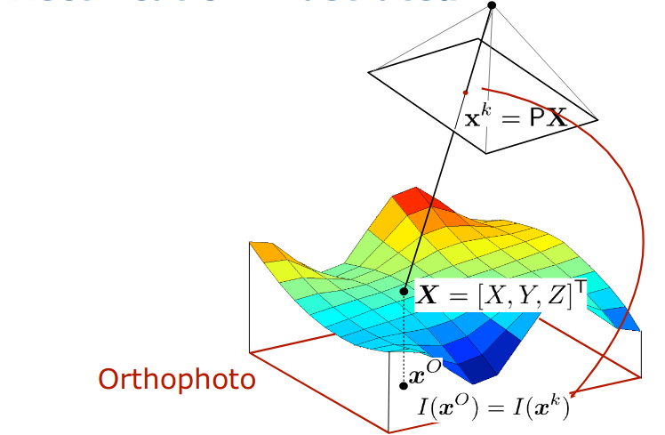
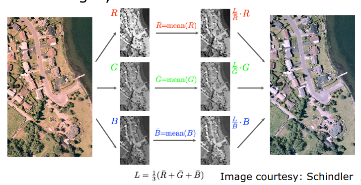
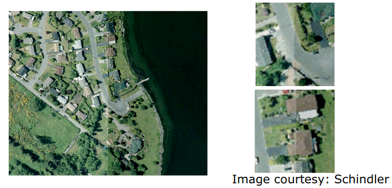
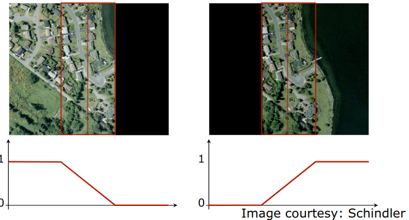
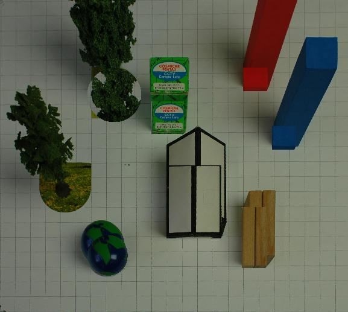

# Orthophoto


## About orthophotos

* This is an image of a surface in orthogonal parallel projection.
* Satellite images can be seen as a good estimation of orthophotos.
* In real case, orthophotos are created synthetically, because it hard for us to have a good projection center as the satellite images.

## Usage of orthophotos

* Orthophoto is created for distance measurement
* They are used in GPS and Map

## Inputs need to create an orthophoto

* Image of the surface of interest.
* Interior and exterior information about the scene when we took images (intrinsic and extrinsic params)
* 3D informations about the scene (3D point cloud or mesh): this can be given as DTM (Digital Terrain Model), DSM (Digital Surface Model), Airbone laser scanning, 
Dense 3D point reconstruction (use Bundle Adjustment) from Aerial images.

## Basic steps to create orthophotos



Assume that we have the image plane (orthophoto image) as large as the real world. Then the ortho projection of each 3D point
$X = [X, Y, Z] ^ T$ into ortho image called x0. We need to compute the pixel intensity for that pixel. 

We know the Projection matrix P to map 3D point into our Sensor coordinate, then we can easily get the pixel where the real world 
point map to the image through (x_k = P @ X), then we just copy the intensity of that pixel image to our orthogonal image by: 

$I(x_0) = I(x_k)$

This is the basic flow to create an orthophoto.

## True orhophoto

To create the true orthophoto, we need to assure these things: 
* Detection of occlusion using DSM.
* Use of multiple images to obtain an orthophoto **without holes**.

## Orthophoto on a Planar Surface

This is the special case, when our 3D model points have the same Z (these point lie on the same plane). This is useful when we need 
a fast way to create orthophoto such as the wall, then use the result to measure something on that wall, etc ... 

```python
# TODO: Continue with this part later ...
```

## Some techniques related to orthophoto
### 1. Orthophoto Stiching
There are three tasks need to do: 
* Global lighting normalization
* Blending of values from different images
* Seam-carving

Also these tasks can be used in other domain (ex. Image stiching).

#### a. Global lighting normalization
This idea based on: "On average, the world is gray". Then our goal is to change each image such that the average color is gray. 
We can do that by the this scheme: 



### b. Blending
Although these images are normalized, when put them together (stiching them), there still a slightly different between, see: 



We can smooth these effect by doing **Linear Blending**, the idea is simple: we choose the weight for each pixel (hight when far away from the joining zone and lower by linear decrease
when approach to the boundary). 



So the joining region will have the sum of weight is 1 for each pixel.

One way to better **Blending** is do the **Seam-carving** before doing **Blending**, the idea of seam-carving is to enhance the result of blending.
Maybe I can do some experiments with this technique before complete this part

Some source that I can read: http://graphics.cs.cmu.edu/courses/15-463/2010_spring/Lectures/blending.pdf
```python
# TODO: Do experiments with Seam-Carving
```

The **Blending** approach after **Seam-carving** then so called the **Distance Transform Blending** which is: 
* A more general form of blending 
* Where the weights for pixels depending on the distance of this point to the Seams.
* Weights are normalized to sum to 1. 
* This is also called **feathering**

## Some problems need to handle

### 1. DSM Interpolation 

During handle the real data, we will notice with the sparity of our data (where the point has the suddenly change in their Z coordinate for example). 
Make denser data mean we have more information about the scene, then the better the result. 

There are few technique that create more 3D data for us:
* Bilinear Interpolation.
* Bicubic Interpolation. (this is better than the latter)
....

### 2. Resampling (point projected from 3D into 2D image)

During the projection, then the constructed image pixel coordinate mapped from 3D are not in form of integers. So we need
to determine which pixel Intensity that these pixels most belong to. Again, the interpolation technique will help us, one more 
way to do that is to choose the closed neighbor w.r.t that pixel and then copy that intensity value. 

### 3. Orthophoto errors

#### a. Incorrect DSM
Due to the wrong information about the 3D scene, then when mapping back these points, the result image will have the shift 
in x, y coordinate (points are displaced in radial direction w.r.t the nadir).

#### b. Occlusions
The height of object occlude the things behind it, so this lead to the black spot (this will happen when we determine correctly which 3D point
are occluded in 3D - points in 3D not seen by the camera as the time we took image, if not, we will have this effect bellow)



