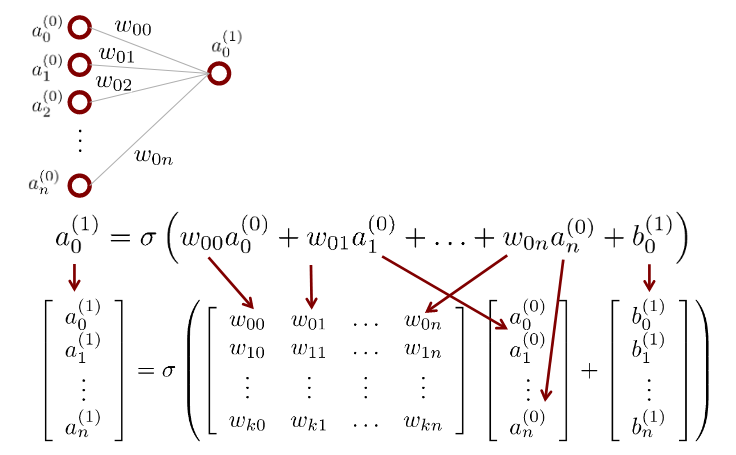
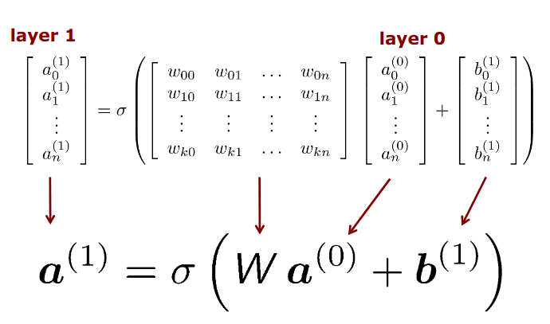
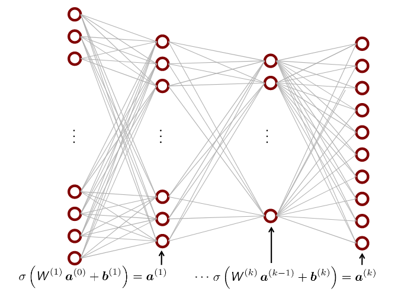
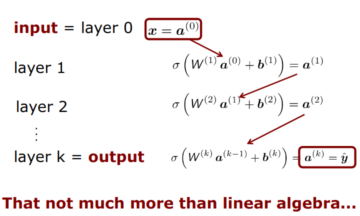
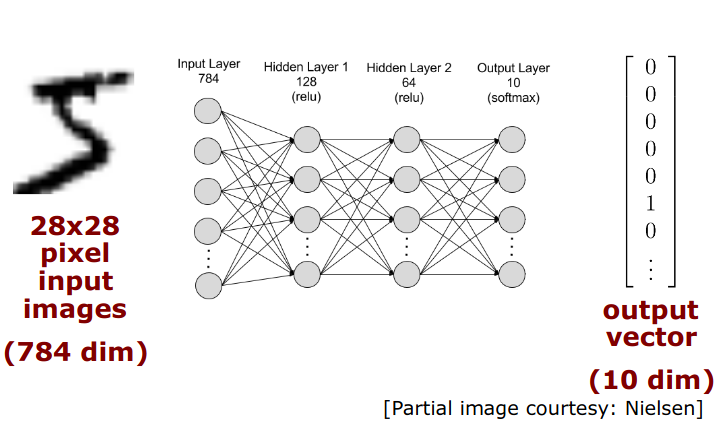
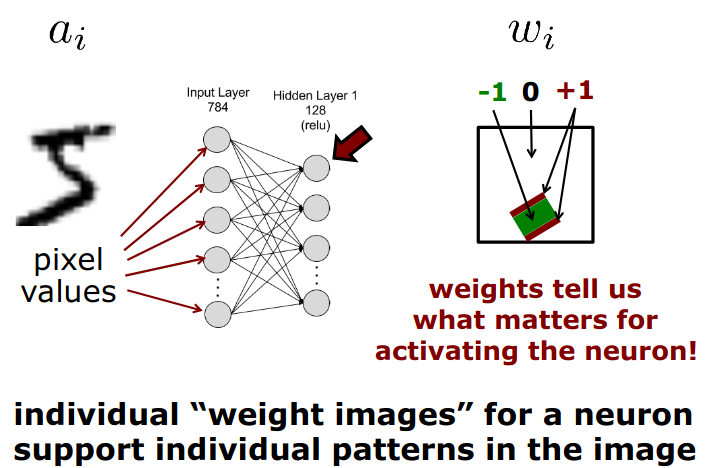
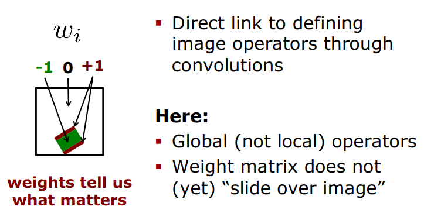
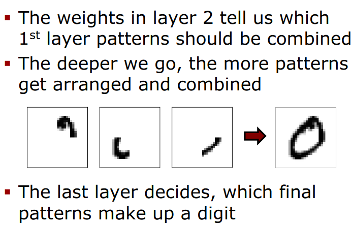
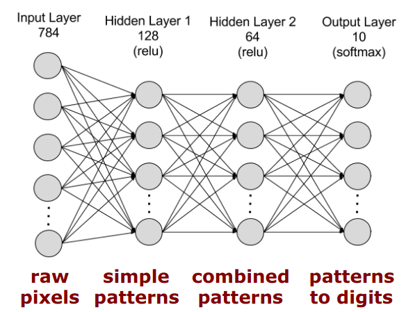

# Neural Networks

## 5 Minutes - Neural Network
- They are used in AI, machine learning
- Take input signal, do some computation on that input signal and generate output (this mean they are functions)
- How do those function look like and how can we specify them ? 
- Neural network contains neurons: they are small computational units. These unit are connected as a network in some way
- Chaining multiple neurons allows for more complex functions.
- Neural network is a concatenation of such simple functions 
- To create a neural network, we need to specify the network with all its neurons and parameters ... 
- Finding good parameters can be very hard -> We learn all these parameters.
- We learn parameters by showing it example images of cats, dogs, ....
- Set the parameters so that the network can classify the given examples correctly.
- Gradient Descent, Stochastic Gradient Descent ,... use to minimize the mismatch between the network output and the true
values. 
- Backpropagation is a technique to compute the gradient of the loss w.r.t the parameters of the network. 
- There exists a large zoo of neural networks (the topology of the network). In usual, we fix the topology and then learn
the parameters from this topology.
- Neural networks are often used when interpreting sensor data.

## Part 1: The Basics of Neural Networks 

Image Classification: single label for an image

Semantic Segmentation: single label for each pixel

* Machine learning technique 
* Often used for classification, semantic segmentation and related tasks 
* Fist ideas discussed in the 1950/1960s
* Theory work on NNs in the 1990s
* Increase in attention from 2000
* Deep learning took off around 2010 
* CNNs for image tasks from 2012

"Neural Network" include Neuron and Network

Neuron: fundamental unit of the brain
Network: Connected elements 

Neural Network include several neurons that are somehow connected. They get information from sensor and they can process 
this information by doing basic computing by forwarding certain signals to other neurons until we reach a certain output 
neuron

### Artificial Neurons
Artificial neurons are the fundamental units of artificial neural networks that: 
* Receive inputs 
* Transform information 
* Create an output 

### Neuron
* Receive inputs/ activations from sensors or other neurons
* Combine/transform information 
* Create an output/activation 

### Neurons as Functions
We can see a neuron as a function:
* Input given by x in R^N (N-D input)
* Transformation of the input data can be described bt a function f
* Output f(x) = y in R (1-D output)

### Neural Network
* Neural Network is a network/graph of neurons
* Nodes are neurons
* Edges represent input-output connection of the data flow

### Neural Network as a Function
* The whole network is again a function (a more flexible functions)
* Multi-layer perceptron or MLP is often seen as the "vanilla" neural network. In MLP, data flows always from one side 
to the other side. Data forwarded in one direction so there are no loop. 
* Input layer takes (sensor) data 
* Output layer provides the function result (information or command)
* Hidden layers do some computations

### Different Types of NNs 
* Perceptron 
* MLP-Multilayer perceptron
* Autoencoder
* CNN - Convolutional NN
* RNN - Recurrent NN 
* LSTM - Long/short term memory NN 
* GANs - Generative adversarial network 
* Graph NN
* Transformer
* ... 

### Multilayer Perceptron Seen as a Function

#### Image Classification Example

Input (x) is a Cat image and output (y) said that that image is a cat. Neural network is a function that perform 
classification task. 

The network input is an image consists of individual pixels. Each pixel stores an intensity value. We have N such 
intensity values.

We can arrange all the intensity values in a N+1 (N pixels plus one dimensional) dim vector.

This vector is the input of the MLP network.

Output we need to turn into the indicator vector (one hot vector). In real word, we need the uncertainty so the output 
layer is vector indicating an activation / likelihood for each label. 


### Single neuron inside MLP 

Single neuron: receive input is the activation of the previous layer and generate the output activation for the next layer.
We have n + 1 different weight which are assigned to the individual edges connecting the current neuron with each inputs
neuron at the previous layer. These weights can be positive or negative impact into the result of the current neuron. 

### Function Behind a Neuron 

A neuron gets activated (a) through:
* A weighted sum of input activation w_i, a_i
* A bias activation b
* An activation function sigma

### Similarity to Convolution

* A neuron is similar to a convolution

A part is actually similar to convolution except that we don't side that kernel on our image. This actually one step of 
this convolution and then adding a bias and an activation function. 

### Activation Function
* Biological neurons are either active or not active
* Bias tells us where the activation happens (this term is use to shift the step function or sth like that to left or 
right-hand side)
* Non-smooth functions (ex. steps) have disadvantages when compute the gradient for backpropagation. 


### Sigmoid Activation Function 
* Common activation function is a sigmoid (also called logistic function)
* Smooth function 
* Squeeze real values into range [0, 1]

### ReLU Activation Function
* Most commonly used one is Rectified linear unit or ReLU
* Often advantages for deep networks
* Bias here once again is a sift amount to tell how easy this neuron can be active

### Common Activation Functions

There are different activation functions 
* sigmoid
* ReLU
* tanh
* atan
* softplus
* identify
* step-function
* ...

### Use a Matrix Notation 



Some mistake here:

Layer (1) has k + 1 neuron -> bias index run from 0 to k and the index activation a as layer (1) from 0 to k too.

### Each Layer Can Be Expressed Through Matrix Multiplications



### Repeat that Layer by Layer ...





### Feedforward Networks
* MLPs are feedforward networks 
* The information flows from left to right
* There are no loops
* Such networks are called feedforward networks
* There exist other variants (ex. RNNs)

### Handwritten Digit Recognition Example

#### A Basic MLP Recognizing Digits 

A mapping from 784 to 10 Dimensions 




#### What Happens in the Layers ? 

For illustration purpose, let's treat activations and weights as images



Weight images for a neuron is basically tell us which input intensities should be there and which should not be there 
and which they don't care. They are actually small pattern recognitions system, they try to recognize a certain pattern 
and give a high value when they find that pattern and the low value if they don't find that pattern. The weight give us 
the shape of the pattern and the bias tells us how strong should that pattern be visible, how strong should be the different
between the white and the black pixels for example. 


#### Link to Local Operators Defines Through Convolutions 

The weight matrix and input image in MLP is a **GLOBAL OPERATOR**, which generate an output just for a single pixel taking 
the whole input image into account and the weight tell you in which way you want to combine the input intensity value to 
define the output value 




#### Weights and Bias = Patterns 
* Weights define the patterns to look for in the image
* Bias tells us how well the image must match the pattern (how strong that pattern signal should be)
* Activation functions "switches the neuron on" if it matches the pattern: if the pattern is found by weight and bias,
the neurons basically switches on (by trigger the function). The neuron as an indicator of lamp saying yes that pattern 
appears, no this not appear and so on ...

#### What Happens in the 2nd Layer



The further I go down in my network, the more patterns can get arranged and the occurrence of this pattern is evaluated 
in order to generate the next signal so if this



#### No Manual Features

Some other classifier (Random Forest), this network also includes the feature computation - it operates directly on the 
input data, no manual features!

That could be a great advantage, but also be a disadvantage. 
* Advantage: I don't need to sit down and think what features could be great, I can let the system learn and figure out 
on its own which feature are needed. 
* Disadvantage: I can't put any background knowledge into this system 

#### Classification Performance

Such a simple MLP achieves a correct classification for approx 96% of the examples

### How to Make the Network Compute What We Want ?
* Structure and parameters are the design choices

***
# Gradient Decent
## 5 Minutes - Gradient Descent
* It's a technique to minimize a function
* It's an iterative approach to minimization starting from an initial value
* The key question is in which direction we need to change params x to minimize the function ?
* The gradient point towards ***the steepest uphill direction***
* What we do that we walk in the direction of the negative gradient 
* In practice, we are not using gradient descent in basic form, we use stochastic gradient descent (due to efficiency). 
Instead of computing exact gradient, we just compute the approximation of the gradient 
* If you consider the loss function (the function we want to minimize) in most problems not a single monolithic function
, it actually a sum of a lot of small functions, the question is do we need all components of that sum in order to 
compute the gradient and the assumptions is no we don't, we can just choose random number of those. Compute the gradient 
over this small set of loss functions and then sum them up and walk into that gradient direction. This is the idea of **SGD**.
* There are several variants of this approach: Adam, ...

## 5 Minutes - Backpropagation

* Use to compute gradients of nested and complex functions
* Often used when training neural networks
* Backprop decomposes functions into local computations which is called a computational graph, stores local variables in
that graph and apply chain rule in a reverse manner in order to compute the gradient of the function.

```text
Backprop = graph + local variables + chain rule
```
* **Computational graph** is a graph where in every node we store mathematical operation like add. We use 2 things here:
**Forward pass** and **Backward pass**. Forward pass evaluates the function at a given location (given by the values of 
variables), we store numbers as the local variables in that graph because we need it later on in the backward pass. **Backward pass**
is used to compute the gradient for the position for that we have computed the forward pass. In **Backward pass** we use
the information of the local variables we have stored before and the information of the first derivatives and can propagate 
this information backward so that we have at the left-hand side are the gradient for that specific location.
* Neural networks can be seen as computational graph. If we look into a single neuron and then write down as the computational 
graph
* We can compute the gradients of a loss function through the neural network. 

## Part 2: Learning Process

Back propagation is the basic technique that we can apply in order to estimate the parameters of the neural network

Parameters of the network let it determine the task that we want it to do. Beside that, the whole structure of a network 
has the impact on what the network actually does. 

### Network Parameters

Given a network structure, weights and biases tell the network on what to do
```text
params = weights + biases
```

### What Means "Learning" ?

We want to estimate the Network Parameters based on training data, we tell the network through training examples what it 
should do, we specify the task through a training dataset

### Loss Function
* Loss function compares what I'm expecting to get with the result that the network given. 

### Loss Over All Examples
* We need to evaluate the performance of the network over all examples.
* **Goal:** Find the parameter vector for the labeled training set given the loss L

### Start
* Initialize parameters randomly
* See how well it performs (bad !)
* How to improve the parameters so that the loss decreases 

### Loss Minimization using Gradient Descent 
* Our problem looks like a non-linear least squares problem
* We have **a lot** of parameters, which make Newton-Gauss computationally tricky.
* Gradient descent is a better way to perform the minimization 

### Gradient Descent in 1D

* The starting location matters the result of Gradient Descent.
* GD just locally makes decisions and locally moves towards the local minimum.

### Gradient Descent in 2D 
* We can do the same in 2D
* Gradients are now the direction vectors 

### Meaning of the Gradient Vector 
* It tells us which dimension of the parameter vector will have a larger impact than others on this minimization 

### Gradient Descent in Higher Dimension Spaces
* This is the same idea, but now the gradient vector has more dimensions

### Keep in Mind...
* Loss for one training example
* Total loss is the average loss of all training examples
* We need to adjust the parameters to minimize the total loss !

### Gradient Over All Examples

### Two Challenges
1. How to optimize the process if we have **a lot of training examples ?**
2. How to compute the gradients for **complex and nested functions ?**


## 1. Handling Large Training Set

### 1st trick: Compute a gradient only on a small, sampled subset of examples

Mini-batch is a subset of the training set, then the trick is in every step of **Gradient Descent**, I'm only using this 
mini-batch in order to minimize my error. This is an approximation because we are ignoring large part of the dataset
in order to find the gradient direction

* We **sample a mini-batch** in each step of gradient descent
* Then we use only mini-batch B to compute the Gradient signal
* We use this to **approximate** the real gradient
* This can approximate down-hill steps but much faster to compute
* This technique is so called: **Stochastic Gradient Descent**.

## 2. Computing the Gradient

### 2nd trick: Compute Gradient step by step
* Use Algorithm: Backpropagation, which is does by computing the gradient one step after the other by basically walking 
through the nested function, do step by step with a lot of simple functions in order to combine them into that nested 
function. 
* Neuron activations are chains of activation functions and matrix-vector multiplication
* The idea is to break down the gradient computation into smaller steps
* Key ingredients of backpropagation is **chain rule**.

# Backpropagation 


